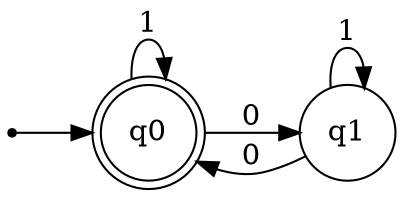

# Project 1: DFA Simulator

## 개요

DFA(Deterministic Finite Automaton) 시뮬레이터를 구현합니다.
이 프로젝트는 오토마타 이론의 가장 기초가 되는 프로젝트입니다.

## 학습 목표

- DFA의 형식적 정의 이해
- 상태 전이의 개념 파악
- 문자열 수락/거부 판정 구현

## 이론적 배경

### DFA의 정의

DFA는 5-tuple (Q, Σ, δ, q₀, F)로 정의됩니다:

| 요소 | 의미 | 설명 |
|------|------|------|
| Q | 상태 집합 | 유한한 상태들의 집합 |
| Σ | 입력 알파벳 | 유한한 입력 기호들의 집합 |
| δ | 전이 함수 | δ: Q × Σ → Q |
| q₀ | 시작 상태 | q₀ ∈ Q |
| F | 수락 상태 집합 | F ⊆ Q |

### 핵심 특성

1. **결정성**: 각 상태에서 각 입력에 대해 정확히 하나의 전이만 존재
2. **완전성**: 모든 (상태, 입력) 쌍에 대해 전이가 정의됨
3. **유한성**: 상태의 개수가 유한함

### 예시: 짝수 개의 0을 포함하는 이진 문자열

```
상태:
- q0: 0의 개수가 짝수 (시작, 수락)
- q1: 0의 개수가 홀수

전이:
- δ(q0, 0) = q1
- δ(q0, 1) = q0
- δ(q1, 0) = q0
- δ(q1, 1) = q1

다이어그램:
        1                1
       ┌─┐              ┌─┐
       │ ↓              │ ↓
      ((q0)) ──0──→   (q1)
             ←──0───
```

## Step-by-Step 구현 가이드

### Step 1: 데이터 구조 설계

**목표**: DFA를 표현할 데이터 구조 정의

**할 일**:
1. 상태를 어떻게 표현할지 결정 (문자열? 정수?)
2. 전이 함수를 어떤 자료구조로 저장할지 결정
   - Dictionary/Map: `{(state, symbol): next_state}`
   - 2D 배열: `transitions[state][symbol]`
3. DFA 클래스/구조체의 속성 정의

**확인 사항**:
- [ ] 상태 집합을 저장할 수 있는가?
- [ ] 알파벳을 저장할 수 있는가?
- [ ] 전이 함수를 조회할 수 있는가?
- [ ] 시작 상태를 알 수 있는가?
- [ ] 수락 상태인지 판별할 수 있는가?

### Step 2: DFA 생성자 구현

**목표**: DFA 객체를 생성하는 방법 구현

**할 일**:
1. 생성자에서 받을 파라미터 정의
2. 입력 유효성 검증 추가
   - 시작 상태가 Q에 포함되는지
   - 수락 상태들이 Q에 포함되는지
   - 모든 전이가 유효한 상태를 가리키는지

**테스트 케이스**:
```
입력:
- states = {q0, q1}
- alphabet = {0, 1}
- transitions = {(q0,0):q1, (q0,1):q0, (q1,0):q0, (q1,1):q1}
- start = q0
- accept = {q0}

기대: DFA 객체가 정상 생성됨
```

### Step 3: 단일 전이 함수 구현

**목표**: 하나의 입력 기호에 대한 상태 전이 구현

**할 일**:
1. `transition(current_state, symbol)` 함수 구현
2. 유효하지 않은 입력에 대한 예외 처리

**테스트 케이스**:
```
입력: current_state=q0, symbol=0
기대: q1

입력: current_state=q0, symbol=1
기대: q0

입력: current_state=q0, symbol=2
기대: 예외 발생 (알파벳에 없는 기호)
```

### Step 4: 문자열 처리 함수 구현

**목표**: 전체 문자열을 처리하여 최종 상태 반환

**할 일**:
1. `process(input_string)` 함수 구현
2. 시작 상태에서 출발
3. 각 문자에 대해 전이 수행
4. 최종 상태 반환

**알고리즘**:
```
function process(input_string):
    current ← start_state
    for each symbol in input_string:
        current ← transition(current, symbol)
    return current
```

**테스트 케이스**:
```
DFA: 짝수 개의 0을 인식

입력: ""
기대: q0 (시작 상태)

입력: "0"
기대: q1

입력: "00"
기대: q0

입력: "010"
기대: q1
```

### Step 5: 수락 여부 판정 구현

**목표**: 문자열이 DFA에 의해 수락되는지 판정

**할 일**:
1. `accepts(input_string)` 함수 구현
2. `process()`를 호출하여 최종 상태 획득
3. 최종 상태가 수락 상태 집합에 포함되는지 확인

**테스트 케이스**:
```
DFA: 짝수 개의 0을 인식

입력: ""      → 기대: True (0개는 짝수)
입력: "0"     → 기대: False
입력: "00"    → 기대: True
입력: "1"     → 기대: True
입력: "101"   → 기대: True
입력: "100"   → 기대: False
```

### Step 6: 실행 추적(Trace) 기능 구현

**목표**: 문자열 처리 과정을 단계별로 보여주기

**할 일**:
1. `trace(input_string)` 함수 구현
2. 각 단계의 (현재상태, 입력기호, 다음상태)를 기록
3. 처리 과정을 출력하거나 리스트로 반환

**출력 예시**:
```
입력: "010"

추적:
  q0 --0--> q1
  q1 --1--> q1
  q1 --0--> q0

최종 상태: q0 (수락)
```

### Step 7: 파일 입출력 구현 (선택)

**목표**: DFA 정의를 파일에서 읽고 쓰기

**할 일**:
1. DFA를 저장할 파일 형식 정의 (JSON, YAML 등)
2. `load_from_file(filename)` 구현
3. `save_to_file(filename)` 구현

**파일 형식 예시 (JSON)**:
```json
{
  "states": ["q0", "q1"],
  "alphabet": ["0", "1"],
  "transitions": {
    "q0": {"0": "q1", "1": "q0"},
    "q1": {"0": "q0", "1": "q1"}
  },
  "start": "q0",
  "accept": ["q0"]
}
```

### Step 8: 시각화 구현 (선택)

**목표**: DFA를 상태 다이어그램으로 시각화

**할 일**:
1. Graphviz DOT 형식으로 출력하거나
2. ASCII 아트로 간단히 표현하거나
3. 시각화 라이브러리 사용

**DOT 형식 예시**:


## 추가 연습 문제

구현 후 다음 DFA들을 정의하고 테스트해보세요:

### 연습 1: "ab"로 끝나는 문자열
- Σ = {a, b}
- 수락: "ab", "aab", "bab", "aaab", ...
- 거부: "", "a", "b", "ba", "aba", ...

### 연습 2: "101" 부분 문자열을 포함하는 문자열
- Σ = {0, 1}
- 수락: "101", "0101", "1010", "11011", ...
- 거부: "", "1", "10", "100", "1001", ...

### 연습 3: 3으로 나누어 떨어지는 이진수
- Σ = {0, 1}
- 문자열을 이진수로 해석
- 수락: "0", "11", "110", "1001", ... (0, 3, 6, 9, ...)
- 거부: "1", "10", "100", ... (1, 2, 4, ...)

## 다음 단계

이 프로젝트를 완료했다면:
1. 다양한 DFA를 직접 설계해보기
2. 상태 최소화에 대해 학습하기 (같은 언어를 인식하는 최소 DFA)
3. [Project 2: NFA Simulator](./02-nfa-simulator.md)로 진행

## 참고 자료

- Sipser, Chapter 1.1: Finite Automata
- 위키피디아: Deterministic finite automaton
